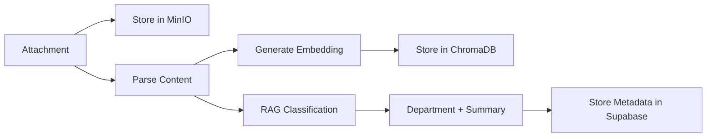

# Doc.X-Intelligent - New Architecture Documentation

## 🏗️ Architecture Overview

### **Complete System Redesign**
The application has been completely restructured to use a modern, scalable architecture:

```
Gmail (KMRL filtered) → N8N → FastAPI → MinIO + Vector DB + Supabase
                                  ↓
                              Frontend UI
```

---

## 📦 Technology Stack Changes

### **Removed**
- ❌ Flask
- ❌ Database binary storage

### **Added**
- ✅ **FastAPI** - Modern async Python web framework
- ✅ **MinIO** - Object storage for documents
- ✅ **ChromaDB** - Vector database for embeddings
- ✅ **OpenAI GPT-4** - RAG-based classification
- ✅ **Docker Compose** - Full containerization

---

## 🔄 Complete Workflow

### **1. Email Processing (N8N)**
```
Gmail Inbox → Filter by "KMRL" keyword → Extract attachments → Send to FastAPI
```

### **2. Document Processing (FastAPI)**


### **3. Classification (RAG + LLM)**
- **Embedding**: OpenAI text-embedding-3-small
- **Classification**: GPT-4 with structured prompt
- **Output**: Department, Summary, Confidence Score

### **4. Storage Architecture**
- **MinIO**: Actual files (PDF, DOCX, Excel, Images)
- **Supabase**: Metadata only (filename, department, summary, etc.)
- **ChromaDB**: Vector embeddings for semantic search

---

## 🚀 Quick Start

### **1. Setup Environment**
```bash
# Copy and configure environment variables
cp backend/.env.example backend/.env

# Edit .env with your credentials
nano backend/.env
```

Required variables:
```env
SUPABASE_URL=your_supabase_url
SUPABASE_KEY=your_supabase_key
OPENAI_API_KEY=your_openai_api_key
```

### **2. Setup Database**
```bash
# Run schema in Supabase SQL Editor
psql -f database_metadata_schema.sql
```

### **3. Start All Services**
```bash
# Start Docker containers
docker-compose up -d

# Services will be available at:
# - FastAPI: http://localhost:8000
# - N8N: http://localhost:5678
# - MinIO Console: http://localhost:9001
# - Frontend: http://localhost:5173 (after npm run dev)
```

### **4. Configure N8N Workflow**
1. Open http://localhost:5678
2. Login: admin / admin123
3. Import workflow: `workflows/fastapi-gmail-processor.json`
4. Configure Gmail OAuth credentials
5. Activate workflow

### **5. Configure Gmail Filtering**
Create a Gmail label "KMRL" and set up a filter:
```
From: (contains "KMRL" OR "official")
OR Subject: (contains "KMRL" OR "invoice" OR "report")
→ Apply label: KMRL
```

---

## 📁 New File Structure

```
backend/
├── main.py                          # FastAPI app
├── Dockerfile                       # Docker configuration
├── requirements.txt                 # Updated dependencies
└── services/
    ├── minio_service.py            # MinIO client
    ├── document_parser.py          # Multi-format parser
    ├── embedding_service.py        # OpenAI embeddings + ChromaDB
    ├── department_classifier.py    # RAG-based classifier
    └── database_service.py         # Supabase metadata

workflows/
├── fastapi-gmail-processor.json    # N8N workflow
└── FASTAPI_WORKFLOW_SETUP.md       # Detailed guide

database_metadata_schema.sql         # Supabase schema (metadata only)
docker-compose.yml                   # Updated with MinIO + FastAPI
```

---

## 🎯 API Endpoints

### **Document Management**
```
POST   /api/documents/upload              # Upload document
POST   /api/documents/search              # Semantic search
GET    /api/documents/{document_id}       # Get document + download URL
GET    /api/documents/department/{dept}   # Get by department
DELETE /api/documents/{document_id}       # Delete document
```

### **N8N Webhook**
```
POST   /api/webhook/n8n                   # Receive from N8N workflow
```

### **Health Check**
```
GET    /                                  # Basic health
GET    /health                            # Detailed health check
```

---

## 🔍 Document Processing Pipeline

### **Supported File Types**
- **PDF**: Text extraction + OCR for scanned documents
- **DOCX/DOC**: Text and tables
- **Excel/CSV**: Data extraction with sheet names
- **Images**: OCR with Tesseract
- **Text**: Direct reading

### **Classification Prompt**
```
Analyze document → Classify into department → Generate 2-3 sentence summary
Departments: Finance, HR, Operations, Engineering, Sales, Marketing, Legal, IT, Customer Support, General
```

### **Example Output**
```json
{
  "document_id": "uuid-123",
  "filename": "KMRL_Invoice_Jan2026.pdf",
  "object_path": "abc-def-123.pdf",
  "department": "Finance",
  "summary": "Invoice for KMRL services dated January 2026. Total amount: ₹50,000. Payment due by February 15, 2026.",
  "confidence": 0.95,
  "metadata": {
    "file_type": "application/pdf",
    "file_size": 245680,
    "source": "gmail",
    "email_subject": "KMRL Invoice - January 2026"
  }
}
```

---

## 🛠️ Development

### **Run FastAPI Locally**
```bash
cd backend
pip install -r requirements.txt
uvicorn main:app --reload --host 0.0.0.0 --port 8000
```

### **Run Frontend**
```bash
cd frontend
npm install
npm run dev
```

### **View Logs**
```bash
# FastAPI logs
docker logs -f fastapi_backend

# N8N logs
docker logs -f n8n

# MinIO logs
docker logs -f minio
```

### **Access MinIO Console**
```
URL: http://localhost:9001
Username: minioadmin
Password: minioadmin123
```

---

## 🔐 Security Considerations

1. **MinIO**: Change default credentials in production
2. **N8N**: Update admin password
3. **Supabase**: Enable RLS (Row Level Security) if needed
4. **OpenAI**: Secure API key in environment variables
5. **CORS**: Configure allowed origins for production

---

## 🎨 Frontend Updates

The frontend API calls have been updated to use FastAPI endpoints:
- Changed base URL from port 5000 (Flask) to 8000 (FastAPI)
- Updated upload, search, and download methods
- Simplified API structure

---

## 📊 Monitoring

### **Check System Health**
```bash
curl http://localhost:8000/health
```

### **View Document Count**
```sql
SELECT department, COUNT(*) 
FROM documents 
GROUP BY department;
```

### **Check MinIO Storage**
```bash
docker exec -it minio mc ls local/documents
```

---

## 🐛 Troubleshooting

### **Issue: FastAPI won't start**
- Check environment variables in `.env`
- Verify MinIO is running: `docker ps | grep minio`
- Check logs: `docker logs fastapi_backend`

### **Issue: N8N workflow not triggering**
- Verify Gmail label "KMRL" exists
- Check OAuth credentials are valid
- Review N8N execution logs

### **Issue: Documents not uploading**
- Verify MinIO is accessible
- Check file size limits
- Review FastAPI logs for parsing errors

### **Issue: Classification incorrect**
- Verify OpenAI API key is valid
- Check API usage limits
- Review classification prompts in `department_classifier.py`

---

## 🚀 Next Steps

1. **Test the workflow**: Send a test email with attachment
2. **Monitor processing**: Check N8N execution logs
3. **Verify storage**: Check MinIO console for uploaded files
4. **Review classification**: Query Supabase for metadata
5. **Test UI**: Upload documents through frontend

---

## 📞 Support

For issues or questions:
1. Check logs in respective containers
2. Review workflow setup in N8N
3. Verify environment variables
4. Test each service independently

---

**Architecture updated on: January 22, 2026**
