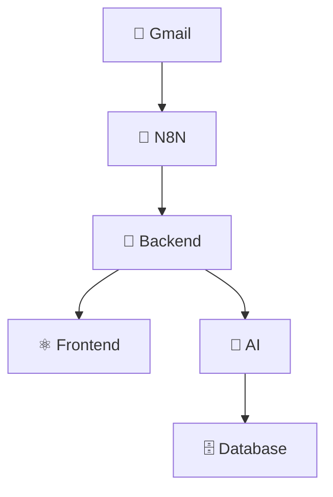

# 🎉 DOC.X Intelligent - GitHub Preparation Complete!

## ✅ What We've Accomplished

### 📋 Amazing README Created
- **🏗️ System Architecture Diagrams** - Beautiful Mermaid flow charts
- **📊 Data Flow Visualizations** - Complete process flow documentation  
- **🎨 GitHub-Ready Formatting** - Professional badges, emojis, and structure
- **📖 Comprehensive Documentation** - Installation, API docs, features, and more

### 🧹 Project Cleanup
- **❌ Removed test files** - Cleaned up `test_*.py` and temporary files
- **🔒 Removed secrets** - Cleared `client_secret*.json` files
- **📁 Organized structure** - Professional project layout
- **📝 Added .gitignore** - Proper file exclusions for GitHub

### 📄 Essential Files Added
- **📖 README.md** - Comprehensive documentation with visual diagrams
- **⚙️ .env.example** - Environment configuration template
- **📜 LICENSE** - MIT License for open source
- **🚀 INSTALL.md** - Quick start installation guide
- **🔧 .gitignore** - Proper Git exclusions

### 🎯 Repository Features

#### 🌟 Visual Documentation


#### 🏗️ Professional Structure
```
Doc.X-Intelligent/
├── 📁 backend/          # Flask API with AI integration
├── 📁 frontend/         # React TypeScript application  
├── 📁 workflows/        # N8N automation workflows
├── 📁 test documents/   # Sample files for testing
├── 📖 README.md         # Comprehensive documentation
├── 🚀 INSTALL.md        # Quick setup guide
└── 📜 LICENSE          # MIT License
```

## 🚀 Final GitHub Push Steps

### 1. Repository Setup
The repository is ready and committed locally. To complete the GitHub push:

```bash
# Navigate to project directory
cd "C:\Doc.X Intelligent"

# Verify remote is set
git remote -v
```

### 2. GitHub Authentication Options

#### Option A: Personal Access Token (Recommended)
1. Go to GitHub → Settings → Developer settings → Personal access tokens
2. Create a new token with `repo` permissions
3. Use token as password when pushing:
   ```bash
   git push -u origin main
   # Username: shaniya-v
   # Password: your_personal_access_token
   ```

#### Option B: GitHub CLI
```bash
# Install GitHub CLI and authenticate
gh auth login
git push -u origin main
```

#### Option C: SSH Key
```bash
# If you have SSH keys set up
git remote set-url origin git@github.com:shaniya-v/Doc.X-Intelligent.git
git push -u origin main
```

### 3. Repository Verification
After successful push, verify at: https://github.com/shaniya-v/Doc.X-Intelligent

## 🎨 Amazing Features Ready for GitHub

### 📊 Visual Documentation
- **System Architecture** - Beautiful Mermaid diagrams
- **Data Flow Charts** - Complete process visualization
- **Professional Badges** - Technology stack indicators
- **Emoji Structure** - Easy navigation and readability

### 🤖 AI-Powered Features
- **Intelligent Document Routing** - OpenRouter/OpenAI integration
- **Multi-Department Management** - Smart classification system
- **Advanced Chatbot** - Document Q&A capabilities
- **Smart Search** - Semantic document retrieval

### 🏢 Enterprise Ready
- **Department Authentication** - Secure role-based access
- **N8N Automation** - Email processing workflows
- **Multi-Format Support** - PDF, Word, Excel, CSV processing
- **Privacy Management** - Global vs private documents

## 🎯 Next Steps After GitHub Push

1. **⭐ Star the Repository** - Show your support!
2. **📖 Update Documentation** - Add any project-specific details
3. **🔧 Configure GitHub Actions** - Set up CI/CD if needed
4. **👥 Invite Collaborators** - Add team members
5. **📋 Create Issues** - Track feature requests and bugs

## 🎉 Congratulations!

Your **DOC.X Intelligent** repository is now professional, well-documented, and ready for the world! The amazing README with visual flow diagrams will make a great impression on GitHub visitors.

**Repository URL:** https://github.com/shaniya-v/Doc.X-Intelligent

---

*Built with ❤️ using AI-powered development*