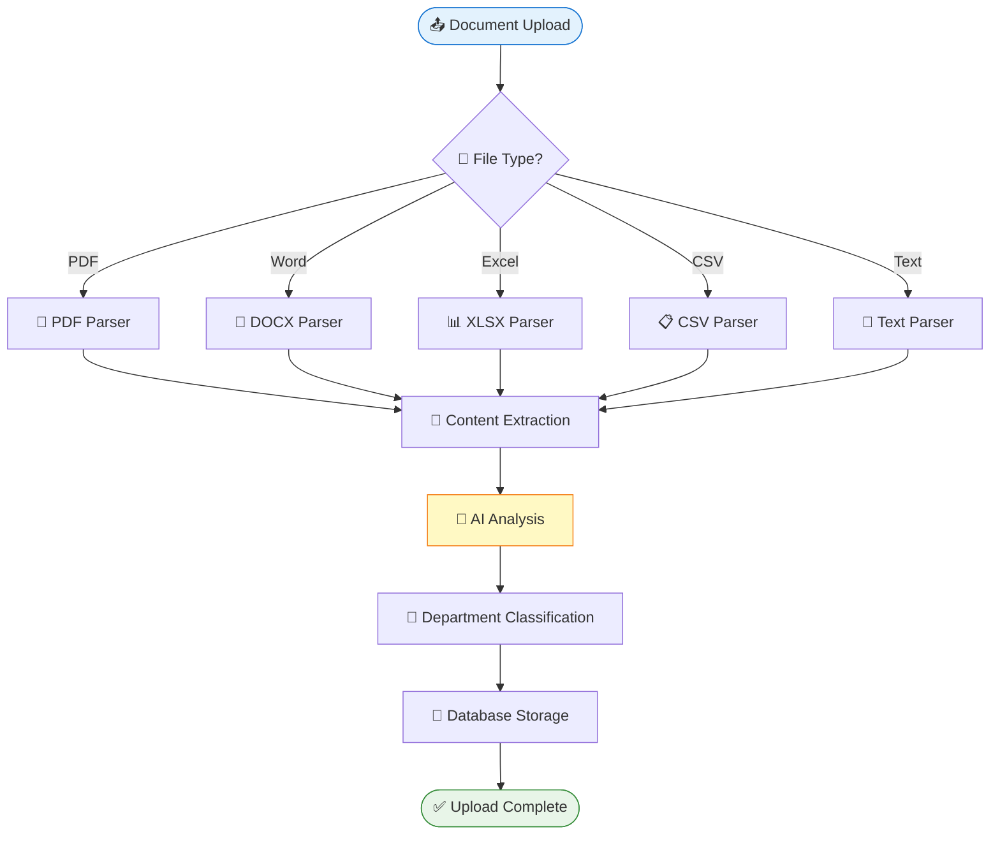
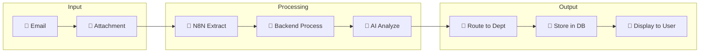
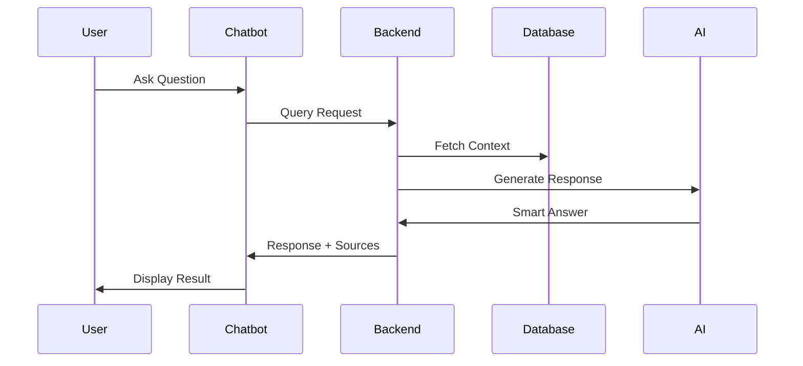
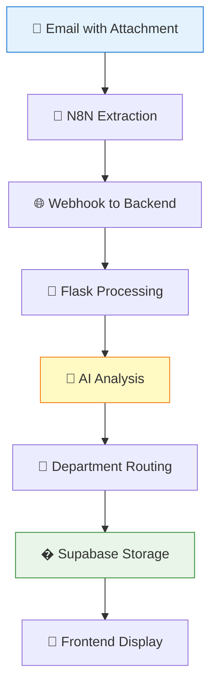

# 🚀 DOC.X Intelligent - AI-Powered Document Management Sy## 🏗️ System Architecture

<div align="center">

### 📊 Complete System Flow

```mermaid
flowchart TD
    A[📧 Gmail] <div align="center">

### 💬 Interactive Chat System

```mermaid
graph LR
    A[👤 User Question] --> B[💬 Chat Interface]
    B --> C[🔗 Backend API]
    C --> D[🔍 Document Search]
    C --> E[🤖 AI Processing]
    D --> F[� Context Retrieval]
    E --> G[💭 Response Generation]
    F --> G
    G --> H[📝 Smart Answer]
    H --> B
    
    style A fill:#fce4ec,stroke:#c2185b
    style E fill:#fff9c4,stroke:#f57f17
    style H fill:#e8f5e8,stroke:#388e3c
```

### �🔄 Upload & Processing Flow



</div>    B --> C[🐍 Backend]
    C --> D[🤖 AI]
    C --> E[🗄️ Database]
    C --> F[⚛️ Frontend]
    
    style A fill:#e3f2fd
    style B fill:#f3e5f5
    style C fill:#fff3e0
    style D fill:#fff9c4
    style E fill:#e8f5e8
    style F fill:#fce4ec
```

### 🔄 Data Processing Pipeline



### 💬 Chatbot Intelligence Flow



</div>v align="center">


**A comprehensive AI-powered document management system with intelligent department routing, multi-language support, and advanced chatbot capabilities.**

[](https://www.typescriptlang.org/)
[](https://reactjs.org/)
[](https://python.org/)
[](https://flask.palletsprojects.com/)
[](https://supabase.com/)
[](https://openai.com/)

</div>

---

## 📋 Table of Contents

- [🌟 Features](#-features)
- [🏗️ System Architecture](#️-system-architecture)
- [📊 Data Flow](#-data-flow)
- [🔧 Technology Stack](#-technology-stack)
- [🚀 Quick Start](#-quick-start)
- [📁 Project Structure](#-project-structure)
- [🔐 Authentication](#-authentication)
- [🤖 AI Capabilities](#-ai-capabilities)
- [📖 API Documentation](#-api-documentation)
- [🛠️ Configuration](#️-configuration)
- [🧪 Testing](#-testing)
- [🤝 Contributing](#-contributing)
- [📄 License](#-license)

---

## 🌟 Features

### 🎯 Core Capabilities
- **🏢 Department-Based Authentication** - Secure login system with department-specific access
- **📧 N8N Email Integration** - Automated document processing from Gmail attachments
- **🤖 AI-Powered Document Routing** - Intelligent department assignment using OpenRouter/OpenAI
- **💬 Advanced Chatbot** - Document Q&A, smart upload, and intent analysis
- **🔍 Smart Search** - Semantic search across all documents
- **🔒 Privacy Management** - Global vs private document visibility
- **📊 Multi-Format Support** - PDF, Word, Excel, CSV, TXT processing
- **🌐 Bilingual Support** - English and Malayalam language processing

### 🎨 User Experience
- **📱 Responsive Design** - Works seamlessly across all devices
- **🍔 Hamburger Menu** - Quick access to inter-department summaries
- **📋 Task Management** - Intelligent task extraction and completion tracking
- **📥 File Download** - Original document download with proper formatting
- **🎛️ Dashboard Analytics** - Real-time statistics and insights

---

## 🏗️ System Architecture

### 📋 Architecture Overview

```
📧 Gmail Email → 🔄 N8N Automation → 🐍 Flask Backend → �️ Supabase Database
                                           ↓
                              🤖 OpenRouter AI Analysis
                                           ↓
                              ⚛️ React Frontend Dashboard
```

### 🔄 Component Flow

**Email Processing:**
- 📧 **Gmail** - Receives emails with document attachments
- 🔄 **N8N Workflow** - Automatically processes incoming emails
- 📎 **Attachment Extraction** - Extracts files from email attachments

**Backend Services:**
- 🐍 **Flask API** - Main backend server handling requests
- 🤖 **OpenRouter AI** - Intelligent document analysis and routing
- 🗄️ **Supabase Database** - Document storage and metadata
- 📄 **Document Processor** - Multi-format file processing

**Frontend Application:**
- ⚛️ **React Dashboard** - Main user interface
- � **Authentication** - Department-based login system
- � **Department Views** - Customized dashboards per department
- 💬 **AI Chatbot** - Document Q&A and smart assistance
- 🔍 **Search & Filter** - Advanced document discovery

**AI Services:**
- 🎯 **Smart Routing** - Automatic department assignment
- 📝 **Content Analysis** - Document type and priority detection
- 💭 **Chat Intelligence** - Context-aware responses

---

## 📊 Data Flow

<div align="center">

### 🔄 Document Processing Workflow



</div>

### 💬 Chatbot Interaction Process

**Document Q&A Flow:**
1. � **User asks question** about uploaded document
2. 💬 **Chatbot forwards** query to backend API
3. 🗄️ **Database retrieval** of relevant document context
4. 🤖 **AI generates** intelligent response with document context
5. 📱 **Display answer** with source document links

**Smart Upload Flow:**
1. 👤 **User uploads** document with intent description
2. 🤖 **AI analyzes** user intent from prompt
3. 📄 **Backend processes** file content extraction
4. 🔒 **Privacy settings** applied (global vs private)
5. ✅ **Confirmation** sent to user with document details

---

## 🔧 Technology Stack

### 🎨 Frontend
```typescript
// React with TypeScript
React 18.x + TypeScript 4.x
Vite (Build Tool)
Tailwind CSS (Styling)
Context API (State Management)
```

### ⚙️ Backend
```python
# Flask with AI Integration
Flask 2.x
OpenRouter API Integration
Supabase Client
Multi-format Document Processing
JWT Authentication
```

### 🗄️ Database & Storage
```sql
-- Supabase PostgreSQL
Documents Table (Content, Metadata, Binary Data)
Task Status Tracking
User Authentication
Privacy Management
```

### 🤖 AI & Automation
```yaml
# AI Services
OpenRouter: LLM Integration
N8N: Email Workflow Automation
RAG: Document Question Answering
Smart Routing: Department Assignment
```

---

## 🚀 Quick Start

### 📋 Prerequisites
```bash
# Required Software
Node.js 18+ 
Python 3.8+
Git
```

### 🛠️ Installation

1. **📥 Clone the Repository**
```bash
git clone https://github.com/shaniya-v/Doc.X-Intelligent.git
cd Doc.X-Intelligent
```

2. **🐍 Backend Setup**
```bash
cd backend
pip install -r requirements.txt

# Environment Configuration
cp .env.example .env
# Edit .env with your API keys:
# - OPENROUTER_API_KEY
# - SUPABASE_URL
# - SUPABASE_KEY
```

3. **⚛️ Frontend Setup**
```bash
cd ../frontend
npm install
```

4. **🔄 N8N Setup (Optional)**
```bash
# Install N8N globally
npm install -g n8n

# Import workflow
n8n import:workflow workflows/DOC.X-Intelligent-Gmail-Processor.json
```

### 🚀 Running the Application

```bash
# Start Backend (Terminal 1)
cd backend
python app.py

# Start Frontend (Terminal 2)
cd frontend
npm run dev

# Start N8N (Terminal 3 - Optional)
n8n start
```

### 🌐 Access Points
- **Frontend**: http://localhost:3001
- **Backend API**: http://localhost:5000
- **N8N Workflow**: http://localhost:5678

---

## 📁 Project Structure

```
Doc.X-Intelligent/
├── 📁 backend/
│   ├── 🐍 app.py                 # Main Flask application
│   ├── 📄 requirements.txt       # Python dependencies
│   ├── 🤖 ai_classifier.py       # AI routing logic
│   ├── 📄 document_processor.py  # File processing utilities
│   └── 📁 data/
│       └── 📚 knowledge_base.json
├── 📁 frontend/
│   ├── 📁 src/
│   │   ├── 📁 components/
│   │   │   ├── ⚛️ DepartmentDashboard.tsx
│   │   │   ├── 💬 AIAssistant.tsx
│   │   │   ├── 🔍 DocumentSearch.tsx
│   │   │   └── 🔐 Login.tsx
│   │   ├── 📁 contexts/
│   │   │   └── 🔑 AuthContext.tsx
│   │   └── 🎨 styles/
│   ├── 📦 package.json
│   └── ⚙️ vite.config.ts
├── 📁 workflows/
│   └── 🔄 DOC.X-Intelligent-Gmail-Processor.json
└── 📖 README.md
```

---

## 🔐 Authentication

### 🏢 Department-Based Login System

The system uses a department-first authentication approach:

```typescript
// Default Credentials (Development)
const DEPARTMENT_CREDENTIALS = {
  "Finance": { username: "department123", password: "456" },
  "HR": { username: "department123", password: "456" },
  "Engineering": { username: "department123", password: "456" },
  "Operations": { username: "department123", password: "456" },
  "Marketing": { username: "department123", password: "456" },
  "Administration": { username: "department123", password: "456" }
};
```

### 🔒 Security Features
- **JWT Token Authentication**
- **Department-specific data isolation**
- **Private document management**
- **Session persistence with localStorage**

---

## 🤖 AI Capabilities

### 🎯 Intelligent Document Routing

```python
# AI-Powered Department Assignment
def analyze_with_rag(content: str, title: str, metadata: dict):
    """
    Uses OpenRouter/OpenAI to intelligently route documents
    Returns: department, confidence, priority, reasoning
    """
    departments = ["Finance", "HR", "Engineering", "Operations", "Marketing"]
    # Advanced RAG analysis with confidence scoring
```

### 💬 Advanced Chatbot Features

1. **📄 Document Q&A**: Ask questions about uploaded documents
2. **🔍 Smart Search**: Semantic search across document database
3. **📤 Intelligent Upload**: Upload with intent analysis
4. **🔒 Privacy Control**: Global vs private document management
5. **🔄 Duplicate Detection**: Content-based duplicate prevention

### 🌟 AI Workflow Examples

```python
# Example: Finance Document Processing
Input: "KMRL_Finance_Report_Sep2025.csv"
AI Analysis: 
├── Department: Finance (95% confidence)
├── Priority: High
├── Content Type: Financial Report
├── Extracted Tasks: Budget review, expense analysis
└── Recommended Actions: Review quarterly spending
```

---

## 📖 API Documentation

### 🔗 Core Endpoints

#### 📄 Document Management
```http
GET    /api/documents                    # List all documents
GET    /api/documents/:department        # Department-specific documents
POST   /webhook/store-document          # N8N document storage
GET    /api/download/:id                # Download original file
```

#### 💬 Chat & AI
```http
POST   /api/chat                        # Chatbot interaction
POST   /api/upload                      # AI-powered upload
GET    /api/search                      # Document search
POST   /api/verify-content              # Content verification
```

#### 👥 User & Department
```http
GET    /api/departments/stats           # Department statistics
GET    /api/department-summary          # Inter-department summary
POST   /api/tasks/:id/complete          # Mark task complete
```

#### 🔒 Privacy & Security
```http
GET    /api/private-documents           # User's private documents
POST   /api/private-documents           # Upload private document
```

### 📊 Response Format

```json
{
  "status": "success",
  "data": {
    "documents": [...],
    "metadata": {
      "total": 50,
      "department": "Finance",
      "processed": 45
    }
  },
  "timestamp": "2025-10-07T01:30:00Z"
}
```

---

## 🛠️ Configuration

### 🔧 Environment Variables

```bash
# Backend Configuration (.env)
OPENROUTER_API_KEY=your_openrouter_key
SUPABASE_URL=your_supabase_url
SUPABASE_KEY=your_supabase_anon_key
FLASK_ENV=development
CORS_ORIGINS=http://localhost:3001

# N8N Configuration
N8N_BASIC_AUTH_ACTIVE=true
N8N_BASIC_AUTH_USER=admin
N8N_BASIC_AUTH_PASSWORD=password
WEBHOOK_URL=http://localhost:5000
```

### ⚙️ Supabase Database Schema

```sql
-- Documents Table
CREATE TABLE documents (
  id TEXT PRIMARY KEY,
  title TEXT NOT NULL,
  content TEXT,
  assigned_department TEXT,
  priority TEXT DEFAULT 'normal',
  confidence INTEGER,
  status TEXT DEFAULT 'processed',
  binary_data TEXT,
  file_size INTEGER DEFAULT 0,
  content_extracted BOOLEAN DEFAULT false,
  source TEXT DEFAULT 'upload',
  language TEXT DEFAULT 'english',
  metadata JSONB,
  created_at TIMESTAMP DEFAULT NOW(),
  updated_at TIMESTAMP DEFAULT NOW()
);

-- Task Status Table
CREATE TABLE task_status (
  id SERIAL PRIMARY KEY,
  document_id TEXT REFERENCES documents(id),
  department TEXT NOT NULL,
  task_description TEXT,
  completed BOOLEAN DEFAULT false,
  completed_at TIMESTAMP,
  created_at TIMESTAMP DEFAULT NOW()
);
```

---

## 🧪 Testing

### 🔬 Test Categories

```bash
# Unit Tests
python -m pytest tests/unit/

# Integration Tests  
python -m pytest tests/integration/

# API Tests
python -m pytest tests/api/

# Frontend Tests
cd frontend && npm test
```

### 🧪 Test Examples

```python
# Test Document Processing
def test_document_processing():
    assert process_csv_content(sample_csv) == expected_tasks
    assert detect_department(finance_doc) == "Finance"
    assert extract_tasks(hr_doc) == hr_tasks

# Test AI Routing
def test_ai_routing():
    result = ai_classifier.analyze("Budget report Q3")
    assert result["department"] == "Finance"
    assert result["confidence"] > 80
```

---

## 🤝 Contributing

### 🌟 How to Contribute

1. **🍴 Fork the Repository**
2. **🌿 Create Feature Branch**
   ```bash
   git checkout -b feature/amazing-feature
   ```
3. **💾 Commit Changes**
   ```bash
   git commit -m "✨ Add amazing feature"
   ```
4. **📤 Push to Branch**
   ```bash
   git push origin feature/amazing-feature
   ```
5. **🔄 Open Pull Request**

### 📝 Development Guidelines

- **📋 Follow TypeScript/Python best practices**
- **🧪 Add tests for new features**
- **📖 Update documentation**
- **🎨 Use conventional commit messages**
- **🔍 Ensure code quality with linting**

### 🐛 Bug Reports

Use the issue template with:
- **📝 Clear description**
- **🔄 Steps to reproduce**
- **🖼️ Screenshots (if applicable)**
- **💻 Environment details**

---

## 📄 License

This project is licensed under the **MIT License** - see the [LICENSE](LICENSE) file for details.

---

## 🙏 Acknowledgments

- **🤖 OpenRouter** - AI/LLM Integration
- **🗄️ Supabase** - Database and Authentication
- **🔄 N8N** - Workflow Automation
- **⚛️ React Team** - Frontend Framework
- **🐍 Flask Community** - Backend Framework

---

## 📞 Support & Contact

<div align="center">

**Need Help? We're Here!**

[](https://github.com/shaniya-v/Doc.X-Intelligent/issues)
[](mailto:support@docx-intelligent.com)

**⭐ Star this repository if you find it helpful!**

</div>

---

<div align="center">

**Built with ❤️ by the DOC.X Intelligent Team**

*Transforming document management with AI-powered intelligence*

</div>
